# Structured Light "Slit" Scanner using ESP32-CAM with IoT capabilites.
3D Reconstruction of Objects on Client Application.
<div>


</div>

---

<details>
  <summary style="font-size: 30px; font-weight: 500; cursor: pointer;">Machine Setup (Physical System)</summary>

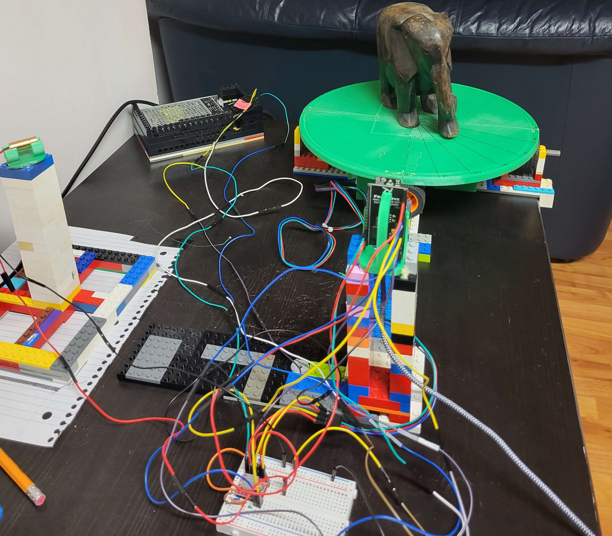

</details>

---
## Project Navigation:


#### CORE Software Features:
[ESP-32 Data Acquisition & TCP Communications to Client C++ Application](#esp-32-data-acquisition--tcp-communications-to-client-c-application) 

[Decoding & Pre-Processing of Image Datasets](#decoding--pre-processing-of-image-datasets)

[**🖥 1.** | Transforming 2D Points into Cylindrical Coordinates for subsequent translation into 3D Cartesian Space]()

[**🖥 2.** | 3D Reconstruction (In Cartesian Space) using Lazer's Planar Equation & Camera Extrincts *(Translation Vector)*]()

[Client Interface *(CLI & OpenGL; Point Cloud Rendering)*](#c-client-interface)

[Camera Calibration *(Intrinsics & Extrinsics)* & Lazer Plane Estimation with Python](#camera-calibration-intrinsics--extrinsics--lazer-plane-estimation-with-python)

#### Mechanical & Electrical Docs:

[⚙️ Physical Design *(CAD Models, Mechanical Specification)*](#3d-reconstruction-procedures--techniques) 

[🔌 Hardware Setup *(Circuit Diagram & Setup Elaborations)*](https://github.com/jasonmzx/3D-Slit-Scanner_ESP32/blob/main/hardware.md) 

---

# Showcase!

#### *Datasets* that worked fairly well:

<details>
  <summary style="font-size: 30px; font-weight: 500; cursor: pointer;">Meditating Monk</summary>
  
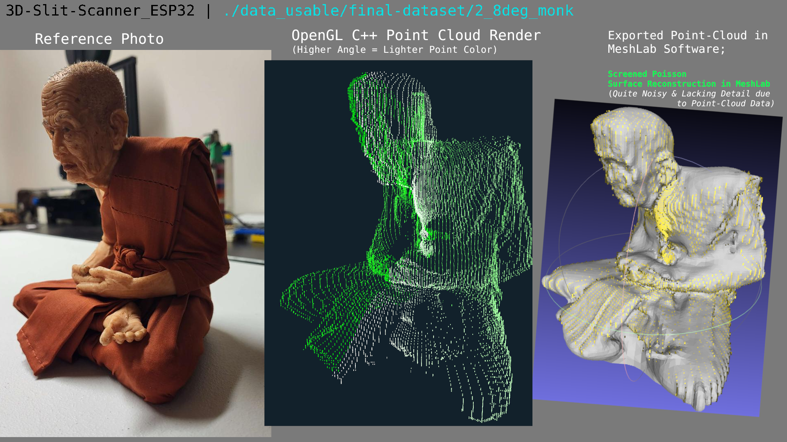

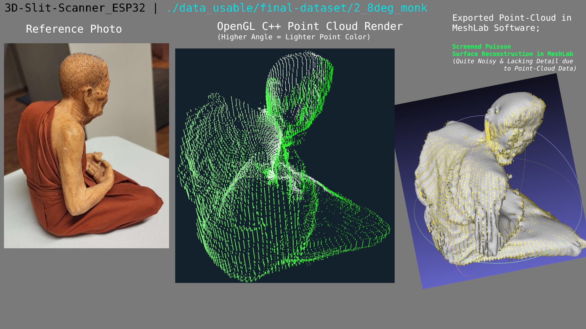

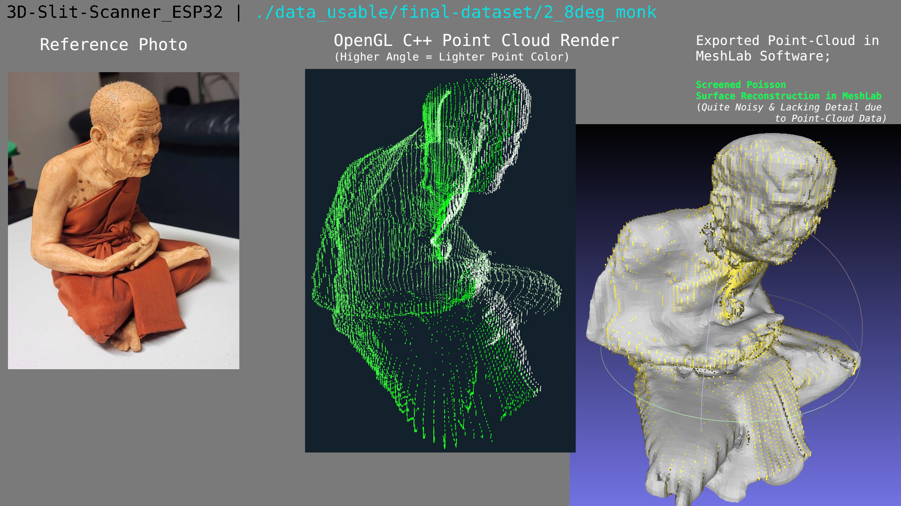

</details>

<details>
  <summary style="font-size: 30px; font-weight: 500; cursor: pointer;">Dog In Cup</summary>
  
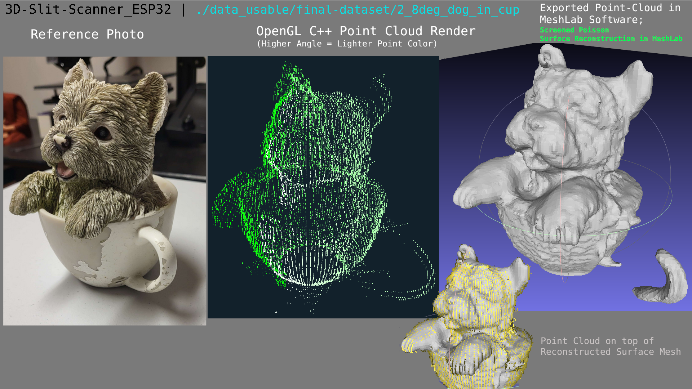

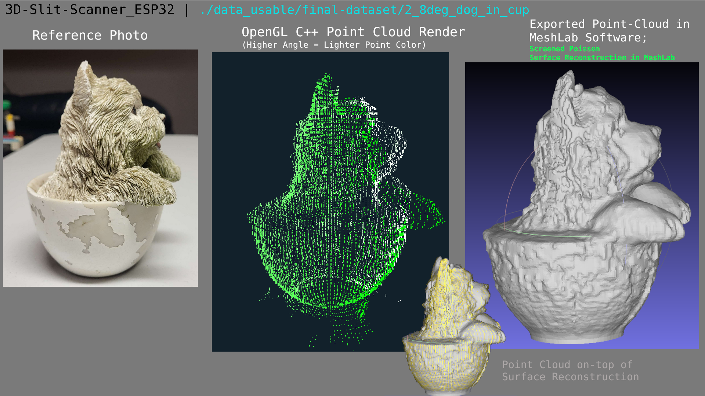

</details>

<details>
  <summary style="font-size: 30px; font-weight: 500; cursor: pointer;">Butter Holder</summary>
  
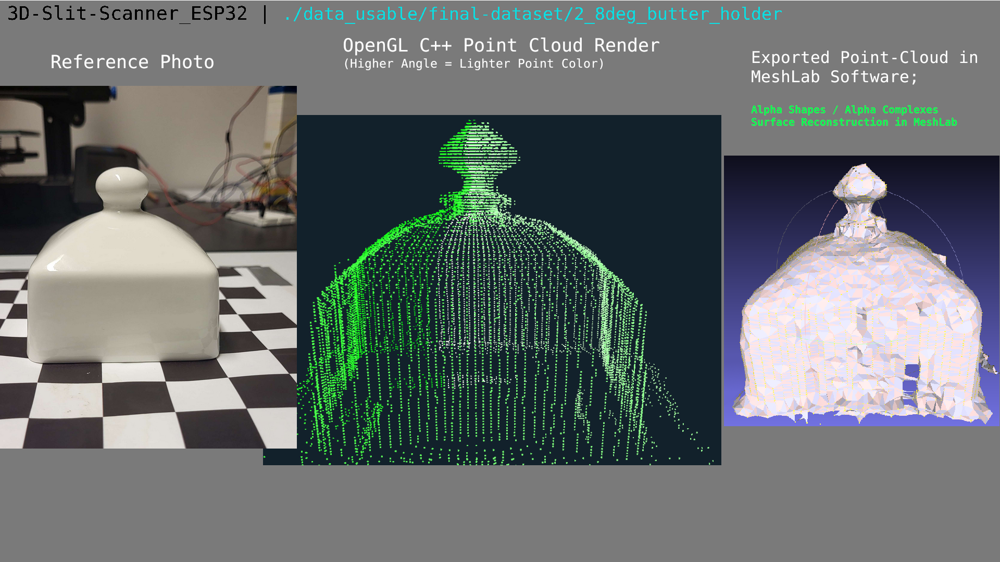

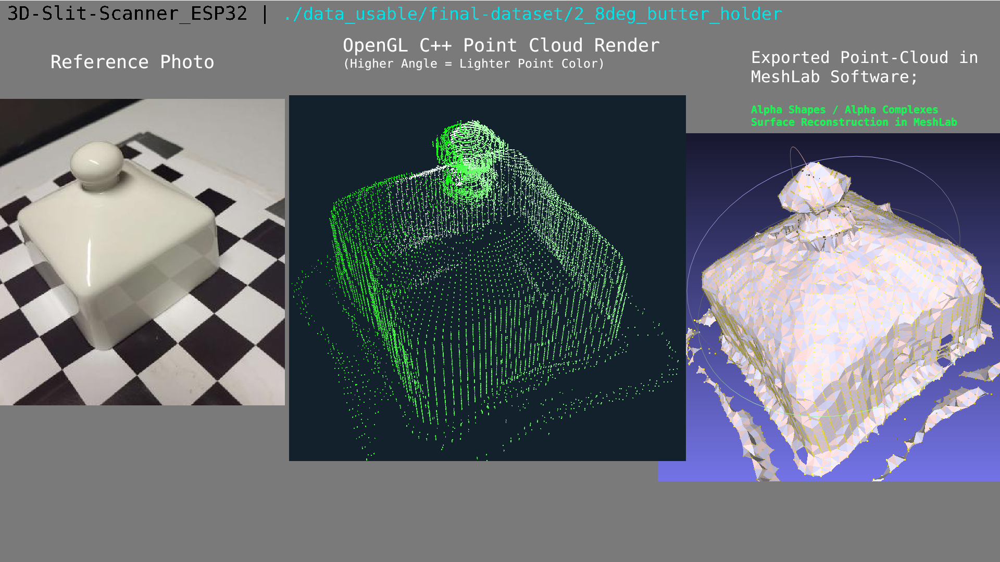

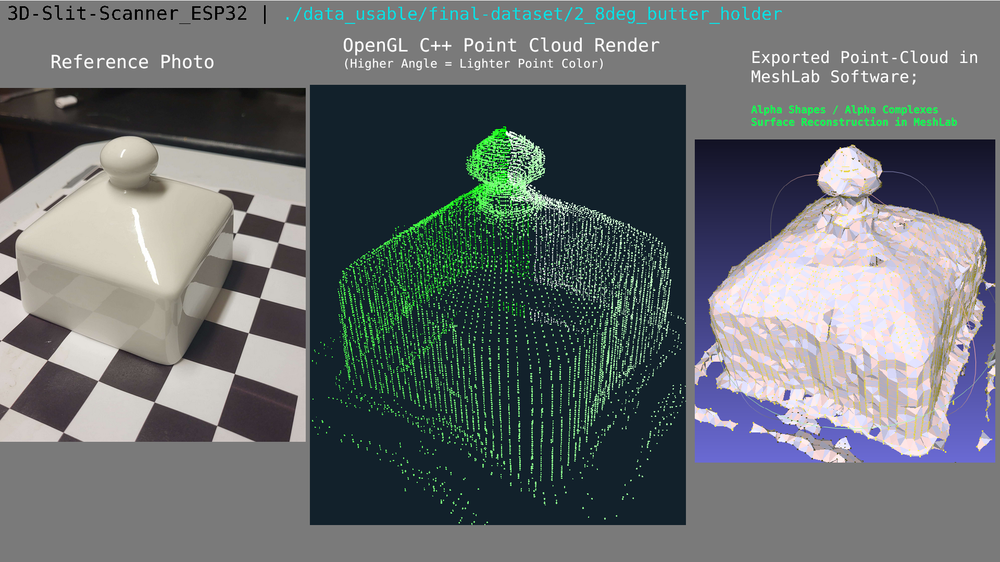

</details>


#### *Datasets* with lots of Missing Information & Noise :

<details>
  <summary style="font-size: 30px; font-weight: 500; cursor: pointer;">Elephant</summary>
  
  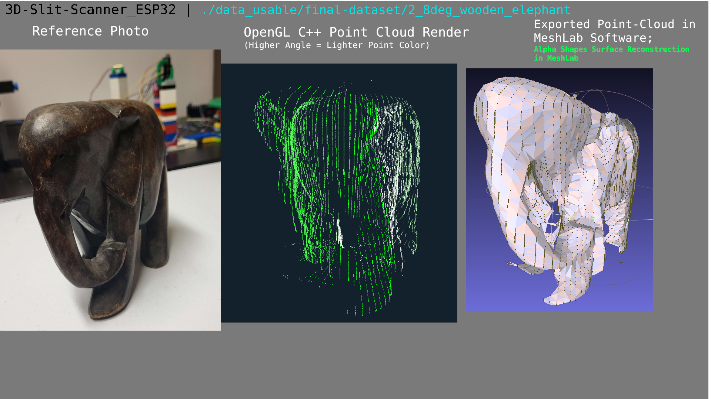

  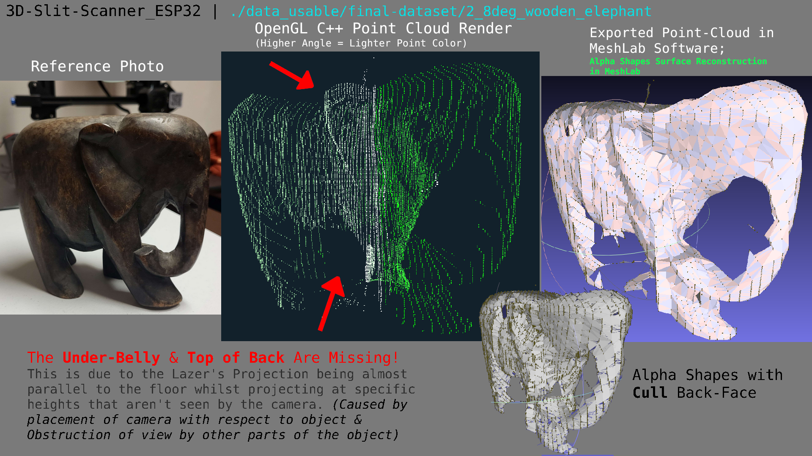

  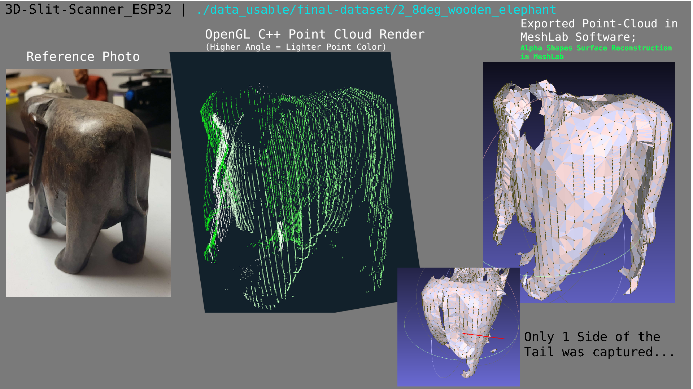

</details>


---

## ESP-32 Data Acquisition & TCP Communications to Client C++ Application

As you can see in the **Machine Setup / Physical System**, there is a Rotating Plate on which an Object is placed on, there is also a line lazer fixed at 15 Degrees, and the ESP-32 Camera Board aligned with the center of the Rotating Plate. *(However the ESP-32 is higher than the Plate)*

For every Rotation, **3 Data Points** need to be captured and sent to the C++ Application **in Order**, View the Table Below.

| Data Point | Example Data |
|----------|----------|
| 1.) Image with Line Lazer Projection | 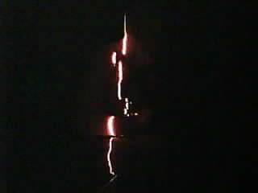 |
| 2.) Image without Line Lazer Projection |  |
| 3.) Acknowledgement | Current Rotation of Object *(Angle in Degrees, as Float Value)* |

The ESP-32 join's my WiFi network upon **setup**. In the **loop** function, the images & acknowledgements are sent in a particular sequence via TCP, as I need to know which image is which, and what acknowledgement they correspond to. TCP is especially good for lossless data transfer over the network.

The C++ Application, on the other end, runs a TCP Server which the ESP writes data to upon every **loop** iteration.

ESP-32 WiFi Connection via `WiFiClient` & `WiFiMulti` libraries.

<details>
  <summary style="font-size: 30px; font-weight: 500; cursor: pointer;">Further Elaborations about Networking System | ESP32 to C++ Client | (Diagrams & More Info.) </summary>


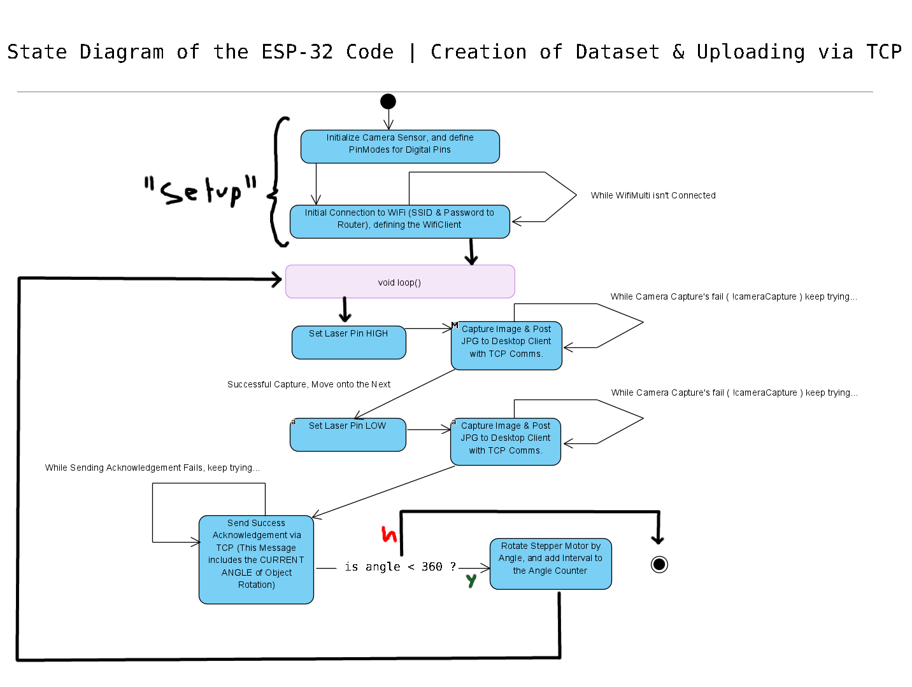

In this Diagram, the actual sending of information is abstracted from the main loop, however the main loop ensures success of these functions, as it tries them until success, and re-tries upon failure. *(False return)*

### State Diagram of the `CaptureImage` & `sendAcknowledgement` Functions

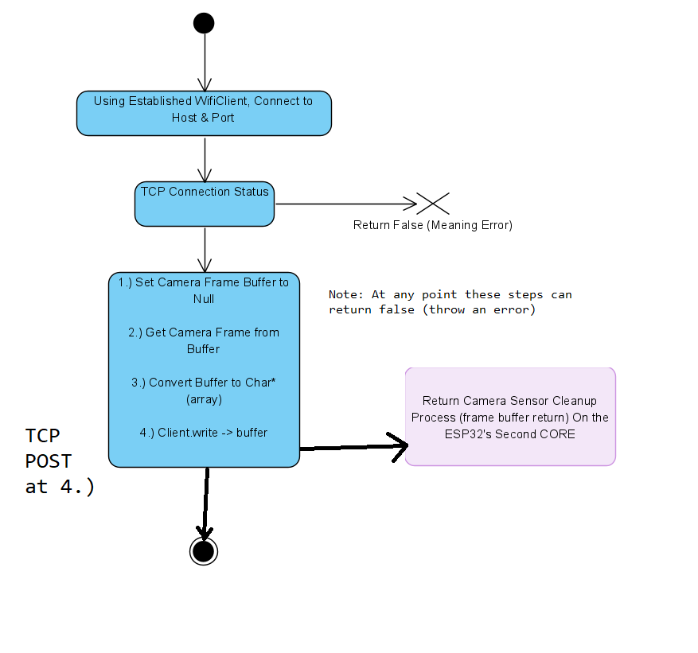

</details>

## Decoding & Pre-Processing of Image Datasets

After network communications between the ESP-32 CAM and Client Application have completed, the client-side application has received a directory full of images with associated meta-data information in the title. *(Binary Type for Pair-Ordering & Angle in Degrees)*

In `struct.h` 
```c++
struct LazerSlice {
    cv::Mat off_img;
    cv::Mat on_img;
    cv::Mat processed_matrix;

    std::vector<glm::vec3> list_3d_points;

    float angle;
};
```

The first step is to parse/decode these images into an ordered structure, with decoded **angle** in degrees, **off_img** set to the `1_...` Image, and **on_img** set to `0_...` Image. This **pair** of images is casted to `cv::Mat` and is used in pre-processing, which returns the **processed_matrix** that is the matrix we'll be reference in the reconstruction algorithms later on.


**NOTE:** Whilst using the second Reconstruction method, you shouldn't use the Perspective Transformation, as the Camera Extrincts are known and
all interpolation of 2D points are done by the Lazer's Planar Equation.

By the end of Decoding & Preprocessing, we should have a list of structs: `std::vector<LazerSlice> slices = { ... }` where each pair represents 1 list entry. *(At this point, `list_3d_points` is still un-assigned)*

---

## Transforming 2D Points into Cylindrical Coordinates for subsequent translation into 3D Cartesian Space

After the Data Acquisition & Pre-processing Phase, We've got a set of `LazerSlice`s, where the `processed_matrix` parameter is essentially a **Binary Mask** , where the activated points is the projected Line Lazer at the specific `angle`. 

More Pre-processing happens to the Binary Masks, such as extracting 1 X,Y Activated Point per Y Layer on the image, and an Undistortion Transformation to rectify Camera Distortion, since the ESP slighly barrels I find. *(Transformation done with cv::undistortPoints, with Camera Matrix & Distortion Coefficients found with Python Script)*

Now I've got clean 2D Lazer Line Projection on the Object at all captured angles *(Discrete Values, from 0 to 360 deg)*. from here I choose an Origin Point *(On the X-axis)* to define the center for all images. **Defined as X-Midpoint**

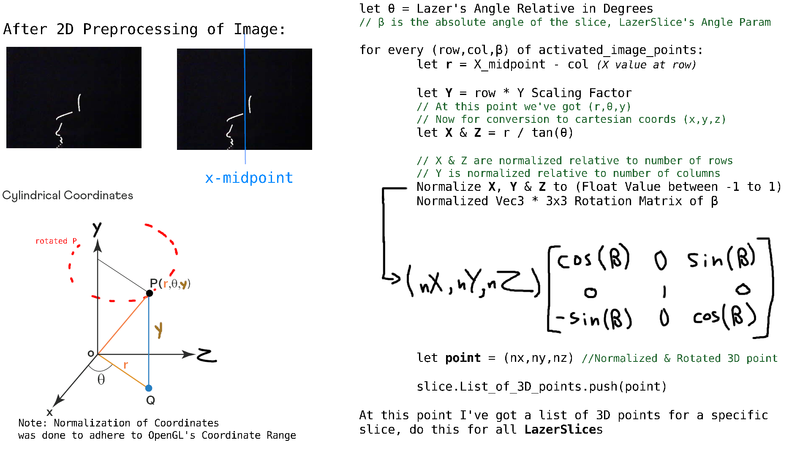

The algorithm takes a 2D image and conceptualizes it as a cross-sectional slice at a specific laser angle, denoted as Θ Θ. This slice is represented in a cylindrical coordinate system, centered around an origin defined by the midpoint of the X-axis in the image. The X and Z coordinates of this slice are then transformed into Cartesian coordinates by dividing them by tan(Θ). Subsequently, these Cartesian coordinates are normalized to fit within the OpenGL coordinate range. 

Finally, the list of 3D points extrapolated from the slice undergoes a rotational transformation *(Vector (x,y,z) multiplied by (3 x 3) Rotation Matrix with the slice's angle as theta `LazerSlice.angle`.* 

**Observation:** Going from Cylindrical to Cartesian, then doing a transformation for rotation of 3D points preserves the relative spatial relationships within the 3D points captured on each slice!

### 3.) 3D Reconstruction (In Cartesian Space) using Lazer's Planar Equation & Camera Extrincts *(Translation Vector)*


# C++ Client Interface

# Camera Calibration *(Intrinsics & Extrinsics)* & Lazer Plane Estimation with Python

---

### Ressources & Inspiration for this project:

[hackster.io ; 3D Scanning with Raspberry Pi and MATLAB](https://www.hackster.io/strangeloop/3d-scanning-with-raspberry-pi-and-matlab-cc30e8)

[ece.cornell.edu, ECE 5725: Embedded OS Project ; Laser 3D Scanner](https://courses.ece.cornell.edu/ece5990/ECE5725_Spring2019_Projects/3D_Scanner_mfx2_tbs47/index.html)

[Brown University ; The Laser Slit 3D Scanner](http://mesh.brown.edu/desktop3dscan/ch4-slit.html)


Less Useful...

[The Complete Guide to 3D Scanners using Laser Triangulation](https://www.3dnatives.com/en/3d-scanner-laser-triangulation080920174-99/amp/)
