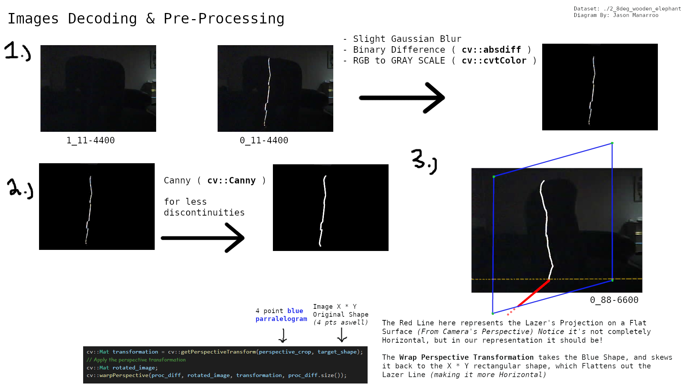

# Structured Light "Slit" Scanner using ESP32-CAM with IoT capabilites.
3D Reconstruction of Objects on Client Application.
<div>


</div>

---
## Project Navigation:


#### CORE Software Features:
[ESP-32 Data Acquisition & TCP Communications to Client C++ Application](#esp-32-data-acquisition--tcp-communications-to-client-c-application) 

[Decoding & Pre-Processing of Image Datasets](#decoding--pre-processing-of-image-datasets)

[**🖥 1.** | Transforming 2D Points into Cylindrical Coordinates for subsequent translation into 3D Cartesian Space]()

[**🖥 2.** | 3D Reconstruction (In Cartesian Space) using Lazer's Planar Equation & Camera Extrincts *(Translation Vector)*]()

[Client Interface *(CLI & OpenGL; Point Cloud Rendering)*](#c-client-interface)

[Camera Calibration *(Intrinsics & Extrinsics)* & Lazer Plane Estimation with Python](#camera-calibration-intrinsics--extrinsics--lazer-plane-estimation-with-python)

#### Mechanical & Electrical Docs:

[⚙️ Physical Design *(CAD Models, Mechanical Specification)*](#3d-reconstruction-procedures--techniques) 

[🔌 Hardware Setup *(Circuit Diagram & Setup Elaborations)*](https://github.com/jasonmzx/3D-Slit-Scanner_ESP32/blob/main/hardware.md) 

---

# Showcase!

<details>
  <summary style="font-size: 30px; font-weight: 500;">Meditating Monk</summary>
  


</details>

<details>
  <summary style="font-size: 30px; font-weight: 500;">Dog In Cup</summary>
  


</details>

<details>
  <summary style="font-size: 30px; font-weight: 500;">Butter Holder</summary>
  


</details>

<details>
  <summary style="font-size: 30px; font-weight: 500;">Elephant</summary>
  

</details>


---

## ESP-32 Data Acquisition & TCP Communications to Client C++ Application


## Decoding & Pre-Processing of Image Datasets

After network communications between the ESP-32 CAM and Client Application have completed, the client-side application has received a directory full of images with associated meta-data information in the title. *(Binary Type for Pair-Ordering & Angle in Degrees)*

In `struct.h` 
```c++
struct LazerSlice {
    cv::Mat off_img;
    cv::Mat on_img;
    cv::Mat processed_matrix;

    std::vector<glm::vec3> list_3d_points;

    float angle;
};
```

The first step is to parse/decode these images into an ordered structure, with decoded **angle** in degrees, **off_img** set to the `1_...` Image, and **on_img** set to `0_...` Image. This **pair** of images is casted to `cv::Mat` and is used in pre-processing, which returns the **processed_matrix** that is the matrix we'll be reference in the reconstruction algorithms later on.



**NOTE:** Whilst using the second Reconstruction method, you shouldn't use the Perspective Transformation, as the Camera Extrincts are known and
all interpolation of 2D points are done by the Lazer's Planar Equation.

By the end of Decoding & Preprocessing, we should have a list of structs: `std::vector<LazerSlice> slices = { ... }` where each pair represents 1 list entry. *(At this point, `list_3d_points` is still un-assigned)*

### 2.) Transforming 2D Points into Cylindrical Coordinates for subsequent translation into 3D Cartesian Space

### 3.) 3D Reconstruction (In Cartesian Space) using Lazer's Planar Equation & Camera Extrincts *(Translation Vector)*


# C++ Client Interface

# Camera Calibration *(Intrinsics & Extrinsics)* & Lazer Plane Estimation with Python

---

### Ressources & Inspiration for this project:

[hackster.io ; 3D Scanning with Raspberry Pi and MATLAB](https://www.hackster.io/strangeloop/3d-scanning-with-raspberry-pi-and-matlab-cc30e8)

[ece.cornell.edu, ECE 5725: Embedded OS Project ; Laser 3D Scanner](https://courses.ece.cornell.edu/ece5990/ECE5725_Spring2019_Projects/3D_Scanner_mfx2_tbs47/index.html)

[Brown University ; The Laser Slit 3D Scanner](http://mesh.brown.edu/desktop3dscan/ch4-slit.html)


Less Useful...

[The Complete Guide to 3D Scanners using Laser Triangulation](https://www.3dnatives.com/en/3d-scanner-laser-triangulation080920174-99/amp/)