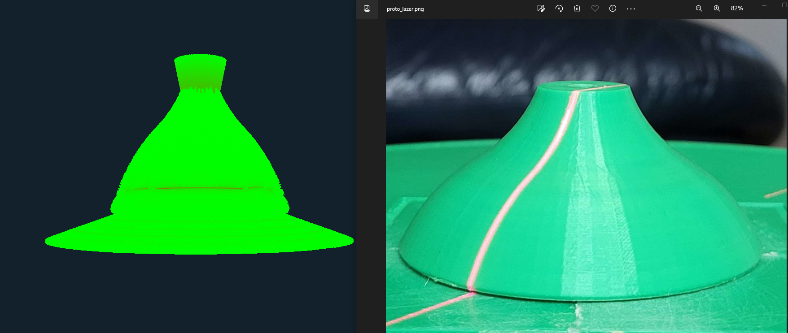
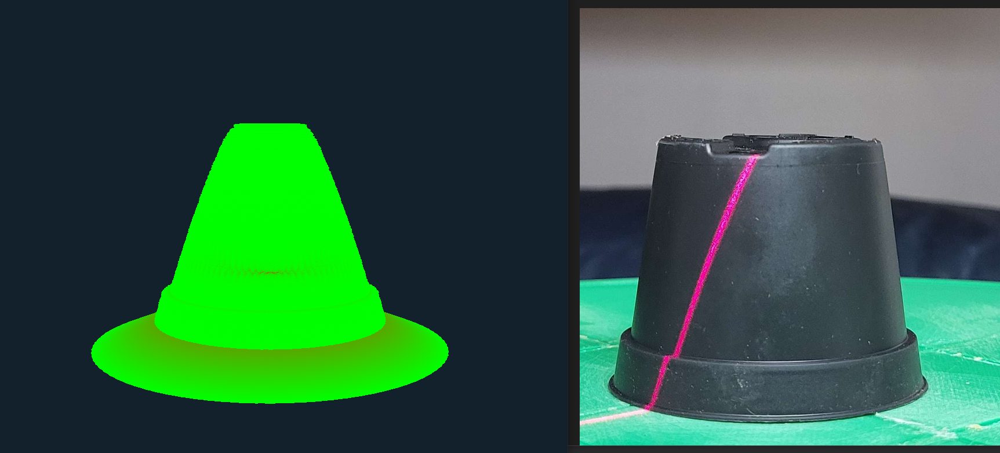
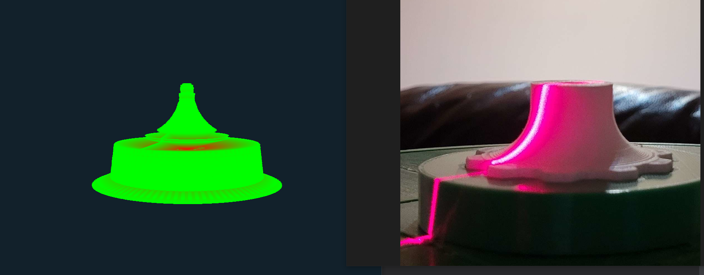

# Research & Proof of Concept for Line Lazer & Image Processing (Optical Triangulation) Document

As I research & implement this project, this document will contain some methodologies & research 

## Prototype I: (Construction of 3D point cloud from a Single Angle of a 2D Line Lazer Projection)

#### Data & Image Processing: 
During this initial prototype, I simply took 2 images of each object for examination. 1 Picture of the object with the Line Lazer projecting onto the object, aswell as the other picture without any projection. With OpenCV, these 2 images are compared, and a Difference Mask is applied to the image *(which extracts the lazer projection)*, along with other pre-processing such as Gaussian Blur. From here, the most centered bright pixel is taken. 

#### 2D points to 3D points interpolation:
From here, the list of bright pixels per row is converted into a point cloud with X, Y and Z coords. X and Y are extracted directly, and Z = ` X / tan(theta) `, theta being the angle between the Line Lazer, and the Camera. *(In the code, `45 Degrees` is set for simplicity's sake)*

#### Rendering in OpenGL:
Points from the interpolation are converted in Vertices with a Lime Green color `(0,255,0)`, and Indices are formed aswell. (`GLuint` and `GLfloat` arrays)

All points are rendered as a Triangle with the point above it *(The next vector in the list, which is usually above it in the Y axis)* and an origin point (In Red) as the 3rd point to form the triangle through 3D space.
This "3D" Slice is then rotate 360 degrees. *(By Multiplying the X and Y axis by sin(A) & cos(A), A being the iteration step between angle 0 and 360 degrees)*

| OpenGL Render vs. Image w/ Line Lazer Projection |  |
|-------|---|
|  | **proto's current errors:**   - 3D Body is slimmer in the rendering (Interpolation?)  - the slightly raised view of the image causes some issues with the 2D triangulation *(At the top of the object's rendering)* |
|  | **proto1's current errors:**   - 3D Body is slimmer in the rendering (Interpolation?)  - The bottom ridge should be perpendicular to the rotating plate, and Projected upon completely vertically *(From the Camera's Point of View)*. Right now it isn't. |
|  | **proto2's current errors: (below)** | 
| - Visual Issues with the rendering of the projection *(Look into: Definition of Vertices & Indices, how they are generated and used in OpenGL)*   - 3D Body is slimmer in the rendering This is also due to coordination normalization, since here we're assuming the Midpoint as Half the image's width which is inaccurate. (Normalization + Interpolation Issue)   - The bottom ridge should be perpendicular to the rotating plate, and Projected upon completely vertically *(From the Camera's Point of View)*. Right now it isn't. | |

